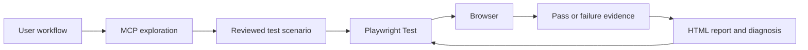

# Playwright MCP UI Automation

**Author:** Mahesh Joshi  
**Purpose:** Learn and build professional UI test automation step by step  
**Current practice site:** [playwright.dev](https://playwright.dev/)  
**Current browser:** Chromium

## Start here

This repository is a learning project and a growing automation framework. It checks whether a website behaves correctly from a user's point of view.

For example, a test can answer:

> Can a user open the Playwright documentation and reach the Installation page?

The framework uses two complementary tools:

- **Playwright Test** runs repeatable automated checks and creates reports.
- **Playwright MCP** helps an AI assistant explore a website, inspect what is visible, and understand how a user can interact with it.

MCP helps us discover a workflow. Playwright Test stores and repeats that workflow. MCP is not a replacement for committed tests.

The test target is configurable through `BASE_URL`. Until a real application is selected, the framework safely uses `https://playwright.dev` as its default practice site.

## Why this project exists

Manual testing is valuable, but repeating the same checks by hand takes time and can lead to missed steps. Automation gives us a repeatable safety check after a change.

This project is being built deliberately so that:

- a non-technical reader can understand what each test protects;
- a beginner can run and debug a test;
- a technical contributor can add tests without guessing the structure;
- MCP-assisted work follows clear safety and quality rules;
- the framework grows only when the application gives us a real reason to add complexity.

## How the framework works



### In plain language

1. We describe an important user journey.
2. MCP can explore the website and help us understand the journey.
3. We write a clear test using stable, user-facing locators.
4. Playwright opens a browser and performs the steps.
5. The test checks the expected result.
6. A report tells us whether the journey passed or where it failed.

## Current status

The foundation is complete. It currently includes:

- a Chromium-first Playwright configuration;
- a typed test fixture entry point;
- small page objects for reusable page interactions;
- two UI smoke scenarios for the Playwright documentation;
- HTML reports and failure artifacts;
- MCP guidance and repository guardrails;
- a staged professional roadmap.
- environment-based URL loading with a safe practice-site fallback.
- local type-checking and a combined `npm run validate` quality gate;
- a GitHub Actions workflow for Chromium UI tests and failure artifacts.

The practice site is intentionally simple. The environment layer is ready for a real application, but the real application URL, business workflows, test data, and authentication strategy still need to be supplied.

## Prerequisites

Install these once on the development machine:

- **Node.js 20 or newer:** runs the JavaScript and TypeScript tooling.
- **VS Code:** recommended editor for this project and MCP usage.
- **Git:** keeps a history of framework and test changes.
- **Playwright MCP enabled in VS Code:** configured in `.vscode/mcp.json`.

No application credentials are required for the current practice site.

## First-time setup

Open a terminal in the project folder and run:

```text
npm install
npx playwright install chromium
```

What these commands do:

- `npm install` downloads the project libraries listed in `package.json`.
- `npx playwright install chromium` downloads the browser used by the tests.

For a real test environment, copy `.env.example` to `.env` and set `BASE_URL`. The `.env` file is ignored by Git. See [docs/environments.md](docs/environments.md).

## Daily commands

| Command | What it means |
| --- | --- |
| `npm run test:chromium` | Run all current UI tests in Chromium. |
| `npm run test:headed` | Run tests with a visible browser window. |
| `npm run test:ui` | Open Playwright UI mode to select and inspect tests. |
| `npm run test:debug` | Open the Playwright inspector for step-by-step debugging. |
| `npm run test:list` | List tests without running them. |
| `npm run test:ci` | Run the CI-equivalent Chromium test command. |
| `npm run typecheck` | Check TypeScript without running browsers. |
| `npm run validate` | Run TypeScript checking and Chromium UI tests. |
| `npm run report` | Open the most recent HTML report. |

### Recommended beginner command sequence

```text
npm run test:list
npm run typecheck
npm run test:chromium
npm run test:headed
npm run report
```

Start with the list, run the tests normally, watch them in headed mode, and then review the report.

The normal local quality gate is:

```text
npm run validate
```

The same type-check and Chromium test stages run in GitHub Actions.

## Understanding the result

- **Passed:** the test completed all actions and its expected result was observed.
- **Failed:** an action or expectation did not complete. Read the error and inspect the attached evidence.
- **Flaky:** a test sometimes passes and sometimes fails without a product change. This is a quality problem to investigate, not a reason to add random waits.
- **HTML report:** a browsable summary of test results.
- **Trace:** a replayable record of a failed test, including actions, pages, and snapshots.

Failure artifacts are stored in ignored folders such as `test-results/` and `playwright-report/`. They help diagnosis and should not be committed.

## Project structure

```text
pages/                          Reusable page objects and UI actions
tests/fixtures/                 Typed shared test fixtures
tests/ui/                       User-facing UI scenarios
playwright.config.ts            Browser, URL, retry, and reporting settings
tsconfig.json                   TypeScript language and type settings
.env.example                    Safe template for the test URL
docs/mcp-playwright.md          MCP exploration workflow and safety rules
docs/environments.md            Environment setup and onboarding checklist
docs/workflows/                 Plain-language workflow briefs and scenario traceability
docs/test-strategy.md           Test design and quality gates
docs/roadmap.md                 Staged professional growth plan
docs/github-actions.md          Continuous integration workflow
docs/integrations.md            Optional GitHub and Jira guidance
.github/copilot-instructions.md Project-wide agent guidance
.github/instructions/          File-scoped Playwright guidance
.github/workflows/              GitHub Actions automation
.vscode/mcp.json                VS Code MCP server registration
```

### Where should a change go?

- Add a user scenario to `tests/ui/`.
- Add repeated page mechanics to `pages/`.
- Add stable shared setup to `tests/fixtures/`.
- Change browser, URL, retries, or artifacts in `playwright.config.ts`.
- Change the local test target in `.env`; never commit that file.
- Describe a business workflow in `docs/workflows/` before automating it.
- Keep external integrations optional; local `npm run validate` must remain enough to verify the project.
- Explain a framework rule in `docs/` or this README.
- Change agent behavior in `.github/` instructions.

## How MCP fits into the workflow

Use MCP when we need help understanding a page or discovering a user journey:

1. Open the approved website.
2. Inspect visible roles, names, labels, links, and headings.
3. Try the smallest interaction needed to understand the workflow.
4. Record the expected visible result or URL.
5. Convert that observation into reviewed Playwright Test code.
6. Run the committed test without depending on MCP.

MCP must not be used with private data, credentials, or systems without authorization. Generated selectors and exploratory artifacts must be reviewed and must not be committed automatically.

Read [docs/mcp-playwright.md](docs/mcp-playwright.md) for the detailed MCP workflow.

## Our quality rules

- Test one clear user outcome at a time.
- Keep tests independent so they can run in any order.
- Prefer accessible locators such as roles and labels.
- Use web-first assertions such as title, URL, and visibility checks.
- Avoid arbitrary sleeps, brittle CSS or XPath chains, and implementation-detail assertions.
- Keep scenario intent in the test and reusable mechanics in page objects.
- Never commit secrets, personal data, browser profiles, or MCP session artifacts.
- Never leave `test.only` in committed code.
- Fix the cause of flakiness instead of hiding it with more retries.

Read [docs/test-strategy.md](docs/test-strategy.md) for the full strategy.

## How to add a test

Before writing code, describe the scenario in one sentence:

> A user can open the Installation guide from the documentation home page.

Then:

1. Use MCP to understand the page if the workflow is unfamiliar.
2. Add the scenario to the relevant file in `tests/ui/`.
3. Use `getByRole`, `getByLabel`, `getByText`, or an intentional test id.
4. Add a page object only for repeated UI mechanics.
5. Run the focused test, then `npm run test:chromium`.
6. Review the report if anything fails.

## Troubleshooting

### The browser is missing

Run:

```text
npx playwright install chromium
```

### The test fails because the website changed

Use headed mode or MCP to inspect the current page. Update the locator or expected outcome only when the user workflow has genuinely changed.

### I need to run against another environment

Copy `.env.example` to `.env`, set `BASE_URL` to the approved non-production URL, and run the suite. Do not use production unless that use has been explicitly approved.

### The editor reports a TypeScript error

Check [tsconfig.json](tsconfig.json), confirm dependencies are installed with `npm install`, and review the exact diagnostic before changing test code.

### A test is slow or intermittent

Run it in headed or debug mode, inspect the trace, and look for timing, isolation, network, or locator causes. Do not begin with arbitrary waits.

### MCP does not respond

Confirm the Playwright server is enabled in VS Code and that `npx @playwright/mcp@latest --help` resolves. Normal Playwright tests should still run without an active MCP session.

### GitHub Actions fails

Open the failed workflow run and download the `playwright-report` or `test-results` artifact. Reproduce locally with `npm run validate` before changing the test.

## Living documentation rule

This README is part of the framework, not a one-time setup note. Update it whenever we add or change:

- a command;
- a folder or responsibility;
- a browser or environment;
- an authentication or test-data approach;
- an MCP workflow or safety rule;
- a quality gate;
- a significant framework decision.

When the README and the implementation disagree, update the documentation and code together, then run the relevant tests.

## Roadmap

The planned growth is documented in [docs/roadmap.md](docs/roadmap.md):

1. Foundation and learning workflows.
2. Real application onboarding.
3. Reliable test harness and test data.
4. Type checking, linting, and quality gates.
5. CI, broader browsers, and product-specific coverage.

We will complete and verify each stage before adding the next layer of complexity.

Read [docs/github-actions.md](docs/github-actions.md) for CI details and [docs/integrations.md](docs/integrations.md) for optional GitHub and Jira planning.

## Ownership

**Author:** Mahesh Joshi  
This framework is being built incrementally for learning, maintainability, and professional automation practice.
