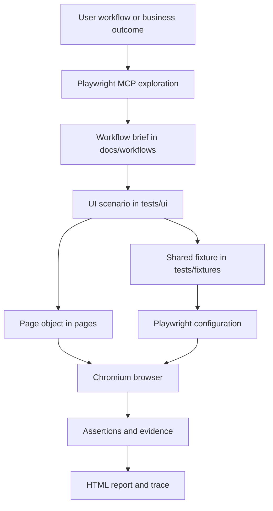
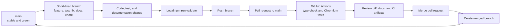
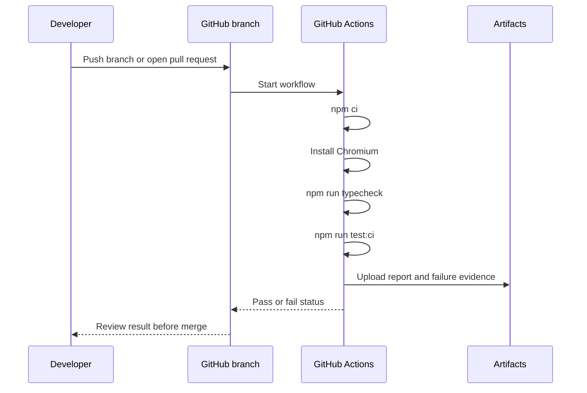

# Project Architecture

This document explains how the framework works and how changes move through the repository. It is written for both technical and non-technical readers.

**Author:** Mahesh Joshi  
**Owner:** Mahesh Joshi  
**Status:** Living document; update it when the framework or delivery workflow changes.

## Runtime architecture

The runtime path describes what happens when a UI test is created and executed.

### Layer responsibilities

- **User workflow:** The behavior we want to protect, expressed in plain language.
- **MCP exploration:** Interactive discovery of visible roles, labels, links, headings, and page states.
- **Workflow brief:** The agreed scenario, preconditions, steps, expected outcome, and traceability ID.
- **UI scenario:** The executable test that expresses the user outcome.
- **Fixture:** Shared, typed setup that is stable across scenarios.
- **Page object:** Reusable page locators and actions; it should not hide the scenario outcome.
- **Configuration:** Browser, environment URL, retries, metadata, and failure artifacts.
- **Browser:** The real user-facing execution surface.
- **Assertions and evidence:** Checks plus screenshots, videos, and traces when failures occur.
- **Report:** The result that helps a contributor understand what passed or failed.

## Delivery architecture

The delivery path describes how a change reaches the stable branch, even when Mahesh is the only contributor.

## Branch rules

- `main` is the stable branch and should remain green.
- Meaningful work starts on a short-lived branch.
- Branch names describe the change, such as `feature/add-search-workflow`, `test/add-login-scenario`, or `docs/update-readme`.
- A pull request is used even for solo work because it preserves review history and lets CI check the change before merge.
- Merge only after the local validation and GitHub Actions checks pass.
- Delete the branch after merging.

See [CONTRIBUTING.md](../CONTRIBUTING.md) for the complete workflow and pull request checklist.

## GitHub Actions architecture

## Guardrails

- MCP is for exploration and debugging; committed Playwright tests are the repeatable source of truth.
- Environment files and credentials never enter Git.
- Tests use stable, user-facing locators and web-first assertions.
- Reports and browser output are useful for diagnosis but are not source code.
- Documentation and workflow briefs are updated with implementation changes.
- Jira, when available, supports planning and traceability but is not required to run tests.

## Growth path

The framework currently runs the practice workflow against `playwright.dev` in Chromium. Future architecture additions should be justified by the real application:

1. Approved non-production application URL.
2. Documented business workflows.
3. Authentication and test-data fixtures when required.
4. Broader browser coverage after Chromium scenarios are stable.
5. Additional quality checks only when the product needs them.
